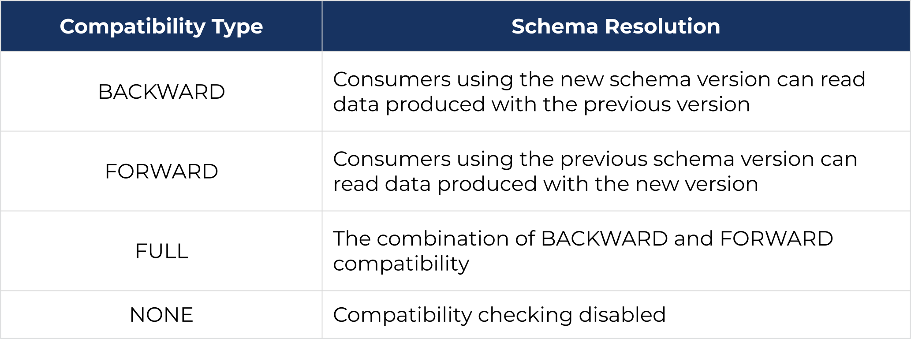
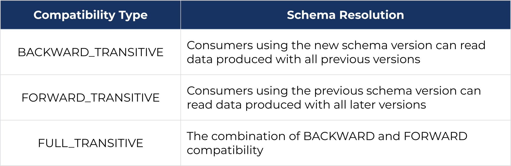

## Commands

```bash
# create a topic

docker exec kafka-1 /opt/bitnami/kafka/bin/kafka-topics.sh --create --bootstrap-server localhost:9092 --replication-factor 2 --partitions 2 --topic test

# list topics
docker exec kafka-1 /opt/bitnami/kafka/bin/kafka-topics.sh --list -bootstrap-server localhost:9092

#delete topic 
docker exec kafka-1 /opt/bitnami/kafka/bin/kafka-topics.sh --delete --topic test --bootstrap-server localhost:9092

# Consumer from a topic
docker exec kafka-1 /opt/bitnami/kafka/bin/kafka-console-consumer.sh --bootstrap-server localhost:9092 --topic test --from-beginning
```


## Consumer 


## Producer 


## Schema Registry
* Prevents data inconsistency and increases data quality.
* Simplifies data governance.
* Reduces development time. Starting with Schema Registry eliminates the need for custom code to manage and validate schemas. This also cuts costs and increases development productivity.
* Facilitates collaboration by providing a standard interface for sharing schemas across different teams and applications. This facilitates collaboration and helps to avoid potential data integration issues.
* Improves system performance. Schema Registry validates and optimizes schemas for efficient data exchange, which can improve system performance and reduce processing time.
  
### Configuration

*  `auto.register.schema`: schemas that are automatically registered by producers. by default is `false`


### Subject Name Strategies [:arrow_upper_right:](https://developer.confluent.io/courses/schema-registry/schema-subjects/#subject-name-strategies)

<details>
   <summary>TopicNameStrategy (default setting)</summary>
   <ul>
        <li>It is the default setting if auto.register.schema is set to true</li>
        <li>It only can be used for a topic /li>
    </ul>
    
    Nomenclature: <topic-name>-<key|value>
</details>

<details>
   <summary>RecordNameStrategy</summary>
   <ul>
        <li> Allows for different schemas in a topic</li>
        <li> No way to tell which topic the record belongs to</li>
    </ul>

    Nomenclature: <fully qualified record name>-<key|value>

</details>

<details>
   <summary>TopicRecordNameStrategy</summary>
   <ul>
        <li>it is the default setting. If  auto.register.schema is set to true</li>
    </ul>

    Nomenclature: <topic>-<fully qualified record name>-<key|value>]-<key|value>
</details>


### Schema Compatibility







**Backward compatibility:**
* you can delete fields and add fields with default values
* update the consumer clients first.

**Forward compatibility:**
  * You can delete fields with default values and add new fields.
  * You need to update your producer clients first.

**Full compatibility>**
* both deleted or added fields must have a default value.
* Since every change to the schema has a default value, the order in which you update your clients doesn’t matter.